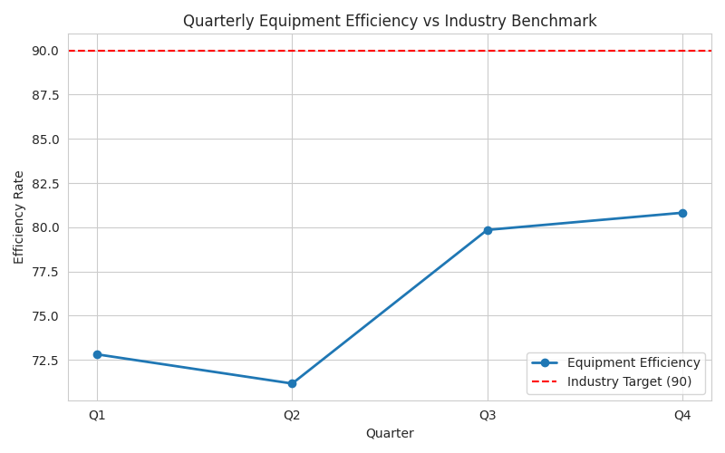

# Equipment Efficiency Analysis – 2024

**Author:** 22f2001638@ds.study.iitm.ac.in  
**Business Case:** Manufacturing Performance Analysis  

## 📊 Key Findings

- Quarterly efficiency rates:
  - Q1: 72.81  
  - Q2: 71.16  
  - Q3: 79.85  
  - Q4: 80.82  
- **Average Efficiency (2024): 76.16**  
- **Industry Benchmark Target: 90**

The company’s equipment efficiency is **far below industry standards**.  
Efficiency is improving through the year, but not enough.

## 📉 Business Implications

- Increased downtime is causing **operational delays**
- Maintenance costs are trending upward
- Lower efficiency impacts:
  - Production volume  
  - Order fulfillment  
  - Energy usage  
  - Workforce strain  

This directly influences profitability and resource planning.

## 🎯 Recommendation: Predictive Maintenance Program

To reach the benchmark of 90, the company must adopt a **predictive maintenance program**, including:

- Sensor-driven monitoring  
- Scheduled component replacement  
- Anomaly detection  
- ML-based failure prediction  
- Central maintenance dashboard  

This will reduce downtime, increase machine lifespan, and improve efficiency trajectory.

## 📈 Visualization

Below is the equipment efficiency trend chart compared with the industry benchmark:

## 📁 Files in This PR

- `analysis.py` – Python script used for analysis and visualization  
- `trend.png` – Equipment efficiency trend chart  
- `README.md` – Data story summarizing insights, implications, and recommendations  
